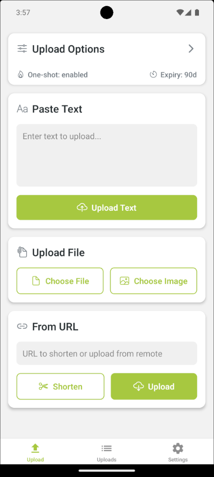

# DroidyPaste


A modern Android application for text sharing, file sharing and URL shortening service based on [rustypaste](https://github.com/orhun/rustypaste). Built with React Native and Expo.


### Demo

| Upload | List Uploads | Settings |
|:---------:|:------------:|:------------:|
|  |   |  |

## Installation

1. Clone the repository
2. Change directory to src
2. Install dependencies:
```bash
npm install
```

3. Start the development server:
```bash
npm start android
```

4. Follow the Expo CLI instructions to run on your desired platform 

`Note: droidypaste is only tested in android platform"

## Configuration

1. Open the app settings
2. Enter your RustyPaste server URL
3. Enter your authentication token and delete token if applicable
4. Save the settings

## Usage

### Text Upload
1. Enter text in the text area
2. Choose between regular upload or one-shot
3. Tap the upload button
4. The result URL will be copied to clipboard and shown in a notification

### File Upload
1. Tap "Upload File" or "Upload Image"
2. Select a file from your device
3. Optionally set an expiry time
4. The file will be uploaded and the URL copied to clipboard

### URL Operations
1. Enter a URL in the input field
2. Choose between:
   - Shorten URL: Creates a short link
   - Upload Remote: Downloads and hosts the remote file

### Share to droidypaste
1. Share files, text or url to droidypaste
2. Files and text are uploaded and urls are shortened
3. The URL copied to clipboard

### Building for Production

1. Configure app.json with your production settings
2. Build for Android:
```bash
   npx expo prebuild --platform android --clean
   cd android
   chmod +x gradlew
   ./gradlew assembleRelease
```
3. Release file location: `src/android/app/build/outputs/apk/release/app-release.apk`

## Contributing

1. Fork the repository
2. Create a feature branch
3. Commit your changes
4. Push to the branch
5. Create a Pull Request

# TODO

- [x] Share intent integration (files, text can be shared through other app)
- [x] Page dedicated for Listing all endpoints & deleting endpoints
- [x] Usable without authtoken
- [ ] Release on fdroid store

## License

MIT License - see LICENSE file for details
