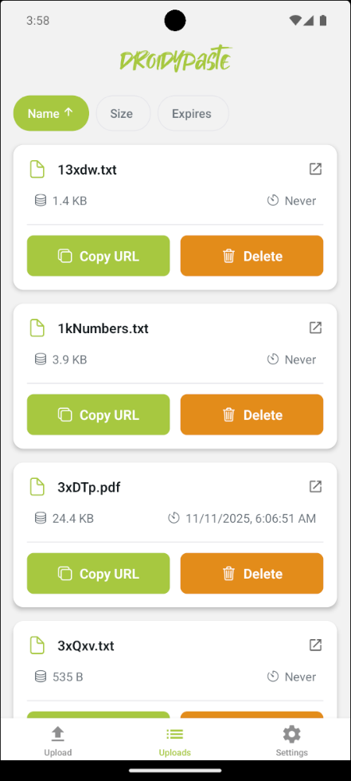

# DroidyPaste


A modern Android application for text sharing, file sharing and URL shortening service based on [rustypaste](https://github.com/orhun/rustypaste). Built with React Native and Expo.


### Demo

| Upload | List Uploads | Settings |
|:---------:|:------------:|:------------:|
|  |   |  |

## Development

### nix-way
1. Clone the repository
```bash
nix develop
avdmanager create avd -k 'system-images;android-35;google_apis;x86_64' -n default --device "pixel_6"
emulator @default
npm run android
```

### Building for Production

1. Configure app.json with your production settings
2. Build for Android:
```bash
   npx expo prebuild --platform android --clean
   cd android
   chmod +x gradlew
   ./gradlew assembleRelease
```
3. Release file location: `android/app/build/outputs/apk/release/app-release.apk`

## Contributing

1. Fork the repository
2. Create a feature branch
3. Commit your changes
4. Push to the branch
5. Create a Pull Request

# TODO

- [x] Share intent integration (files, text can be shared through other app)
- [x] Page dedicated for Listing all endpoints & deleting endpoints
- [x] Usable without authtoken
- [ ] Release on fdroid store

## License

MIT License - see LICENSE file for details
